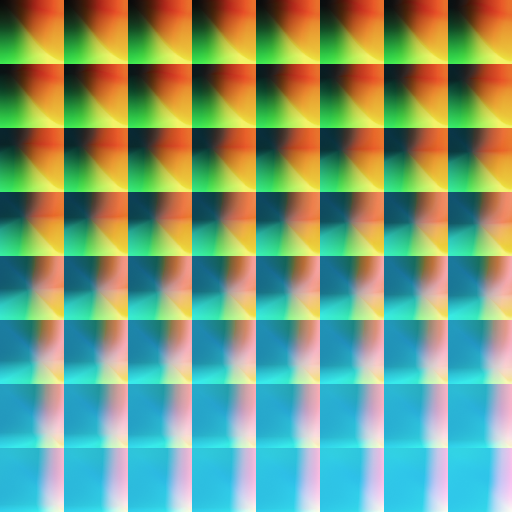

下面我们来解释下上面的这张图片和如何使用：
首先观察一下这个图片

- 8*8 的方块组成
- 整体上看每个方块左上角从左上往右下由黑变蓝
- 单独每个个方块的右上角是红色为主
- 单独每个个方块的左下角是绿色为主

上述的信息有没有给你一点点启示呢？
我们在简化一点
颜色是 r g b 三个值，都以归一化的值表示（ 1 代表 255 ）。

- 整体对每个小方块而言，从左上往右下 b 从 0 到 1 ，是 z 字型的顺序
- 单独对每个小方块而言，从左到右 r 从 0 到 1，代表 x
- 单独对每个小方块而言，从上到下 g 从 0 到 1，代表 y

所以得到 0,0,1 的纯蓝色对应的位置就是 (7 * 64 , 7 * 64)，右下角的那个方块。

链接：https://www.jianshu.com/p/b327416be72e

