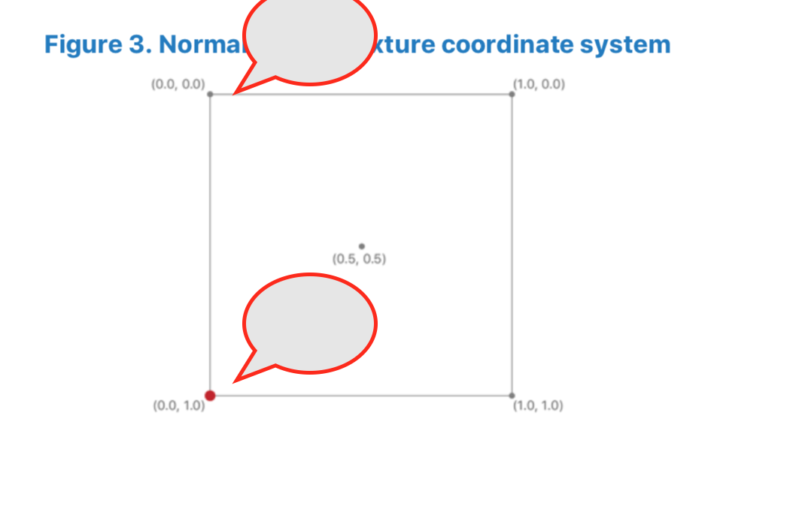

<https://www.young40.com/> [[杨世玲](https://www.young40.com/)]


### 版本选择 

```swift	
	#if __METAL_VERSION__ >= 200 
		....
	#endif
```


### 标准纹理坐标系 感觉和OpenGL 不一样的  OpenGL的原点在左下角



# Metal  Data types


*  ### Metal scalar data types	

| Type                                             | Description                                                  |
| ------------------------------------------------ | ------------------------------------------------------------ |
| bool                                             | A conditional data type that has the value of either true or false. The value true expands to the integer constant 1, and the value false expands to the integer constant 0. |
| char int8_t                                      | A signed two’s complement 8-bit integer.                     |
| `unsigned char uchar uint8_t `                   | An unsigned 8-bit integer.                                   |
| `short int16_t `                                 | A signed two’s complement 16-bit integer.                    |
| `unsigned short ushort uint16_t `                | An unsigned 16-bit integer.                                  |
| int int32_t                                      | A signed two’s complement 32-bit integer.                    |
| `unsigned int uint uint32_t `                    | An unsigned 32-bit integer.                                  |
| long  int64_t  All OS: Since Metal 2.2.          | A signed two’s complement 64-bit integer.                    |
| unsigned long uint64_t  All OS: Since Metal 2.2. | An unsigned 64-bit integer.                                  |
| half                                             | A 16-bit floating-point. The half data type must conform to the IEEE 754 binary16 storage format. |

|      Type | Description                                                  |
| --------: | ------------------------------------------------------------ |
|     float | A 32-bit floating-point. The float data type must conform to the IEEE 754 single precision storage format. |
|    size_t | An unsigned integer type of the result of the sizeof operator. This is a 64-bit unsigned integer. |
| ptrdiff_t | A signed integer type that is the result of subtracting two pointers. This is a 64-bit signed integer. |
|      void | The void type comprises an empty set of values; it is an incomplete type that cannot be completed. |


* Size and alignment of scalar data types

  | Type                                            | Size  (in bytes) | Alignment (in bytes) |
  | ----------------------------------------------- | ---------------- | -------------------- |
  | bool                                            | 1                | 1                    |
  | `char int8_t unsigned char uchar uint8_t `      | 1                | 1                    |
  | `short int16_t unsigned short ushort uint16_t ` | 2                | 2                    |
  | `int int32_t unsigned int uint uint32_t `       | 4                | 4                    |

  | Type                                   | Size  (in bytes) | Alignment (in bytes) |
  | -------------------------------------- | ---------------- | -------------------- |
  | `long int64_t unsigned long uint64_t ` | 8                | 8                    |
  | size_t                                 | 8                | 8                    |
  | half                                   | 2                | 2                    |
  | float                                  | 4                | 4                    |


* Textures

```Swift
enum class access { sample, read, write, read_write };

sample — 图形或内核函数可以对纹理对象进行采样。 sample表示使用和不使用采样器从纹理读取的能力.
read - 没有采样器，图形或内核函数只能读取纹理对象。
write - 图形或内核函数可以写入纹理对象。
read_write - 图形或内核函数可以读取和写入纹理对象

```


```c++
texture1d<T, access a = access::sample>
texture1d_array<T, access a = access::sample>
texture2d<T, access a = access::sample>
texture2d_array<T, access a = access::sample>
texture3d<T, access a = access::sample>
texturecube<T, access a = access::sample>
texturecube_array<T, access a = access::sample>
texture2d_ms<T, access a = access::read> 
texture2d_ms_array<T, access a = access::read>
```

```c++
depth2d<T, access a = access::sample> 
depth2d_array<T, access a = access::sample>
depthcube<T, access a = access::sample> 
depthcube_array<T, access a = access::sample>
depth2d_ms<T, access a = access::read>
depth2d_ms_array<T, access a = access::read>
```


*  Sampler state enumeration values

| Enumeration                                                  | Valid Values                                                 | Description                                                  |
| ------------------------------------------------------------ | ------------------------------------------------------------ | ------------------------------------------------------------ |
| coord                                                        | normalized (default) pixel                                   | When sampling from a texture, specifies whether the texture coordinates are normalized values. |
| address                                                      | repeat mirrored_repeat clamp_to_edge (default) clamp_to_zero clamp_to_border | Sets the addressing mode for all texture coordinates.        |
| `s_address t_address r_address `                             | repeat mirrored_repeat clamp_to_edge (default) clamp_to_zero clamp_to_border | Sets the addressing mode for individual texture coordinates. |
| `border_color ` 								macOS: Metal 1.2. iOS: No support. | transparent_black (default) opaque_black opaque_white        | Specifies the border color to use with the clamp_to_border addressing mode. |
| filter                                                       | nearest (default) linear                                     | Sets the magnification and minification filtering modes for texture sampling. |
| mag_filter                                                   | nearest (default) linear                                     | Sets the magnification filtering mode for texture sampling.  |
| min_filter                                                   | nearest (default) linear                                     | Sets the minification filtering mode for texture sampling.   |
| mip_filter                                                   | none (default) nearest linear                                | Sets the mipmap filtering mode for texture sampling. If none, then only one level-of-detail is active. |
| `compare_func `                                              | never (default) less less_equal greater greater_equal equal not_equal always | Sets the comparison test used by the sample_compare and gather_compare texture functions. |


* ## 数学函数

数学函数位于Metal标准库中，并在头文件`<metal_match>`中定义。`T`是浮点型标量货向量。Ti仅指整型标量或向量


| 内置数学函数                | 描述                                                         |
| --------------------------- | ------------------------------------------------------------ |
| `T acos(T x)`               | 计算x的反余弦                                                |
| `T acosh(T x)`              | 计算x的反双曲余弦值                                          |
| `T asin(T x)`               | 计算x的反正弦值                                              |
| `T asinh(T x)`              | 计算x的反双曲正弦                                            |
| `T atan(T y_over_x)`        | 计算x的反正切                                                |
| `T atan2(T y, T x)`         | 计算y在x上的反正切                                           |
| `T atanh(T x)`              | 计算x的双曲正切                                              |
| `T ceil(T x)`               | 使用舍入到正无限舍入模式将x舍入为整数值                      |
| `T copysign(T x, T y)`      | Return x with its sign changed to match the sign of y.       |
| `T cos(T x)`                | 计算x的余弦值                                                |
| `T cosh(T x)`               | 计算x的双曲余弦值                                            |
| `T cospi(T x)`              | 计算 `cos(πx)`                                               |
| `T divide(T x, T y)`        | 计算 x / y                                                   |
| `T exp(T x)`                | Exponential base e function.                                 |
| `T exp2(T x)`               | Exponential base 2 function.                                 |
| `T exp10(T x)`              | Exponential base 10 function.                                |
| `T fabs(T x)`  `T abs(T x)` | Compute absolute value of a floating-point number.           |
| `T fdim(T x, T y)`          | x – y if x > y; +0 if x <= y.                                |
| `T floor(T x)`              | Round x to integral value using the round to negative infinity rounding mode. |
| `T fma(T a, T b, T c)`      | Returns the correctly rounded floating-point representation of the sum of c with the infinitely precise product of a and b. Rounding of intermediate products shall not occur. Edge case behavior is per the IEEE 754-2008 standard. |


* ## 矩阵函数

| 内置矩阵函数                                                 | 描述                               |
| ------------------------------------------------------------ | ---------------------------------- |
| `float determinant(floatnxn)`  `half determinant(halfnxn)`   | 计算矩阵的行列式。矩阵必须是方阵。 |
| `floatmxn transpose(floatnxm)`  `halfmxn transpose(halfnxm)` | 转置矩阵。                         |


* ## 几何函数


| 内置几何函数                           | 描述                                                         |
| -------------------------------------- | ------------------------------------------------------------ |
| T cross(T x, T y)  叉积                | Return the cross product of x and y.  T must be a 3-component vector type. |
| Ts distance(T x, T y) 距离             | Return the distance between x and y, i.e., length(x-y)       |
| Ts distance_squared(T x, T y) 距离平方 | Return the square of the distance between x and y.           |
| Ts dot(T x, T y)  点积                 | Return the dot product of x and y, i.e., x[0] *y[0] + x[1]* y[1] + ... |
| T faceforward(T N, T I, T Nref) 前方   | If dot(Nref, I) < 0.0 return N, otherwise return –N.         |
| Ts length(T x) 长度                    | Return the length of vector x, i.e., sqrt(x[0]2 + x[1]2 + ...) |
| Tslength_squared(T x) 长度平方         | Return the square of the length of vector x, i.e., (x[0]2 + x[1]2 + ...) |
| T normalize(T x) 法向量                | Returns a vector in the same direction as x but with a length of 1. |
| T reflect(T I, T N)                    | For the incident vector I and surface orientation N, returns the reflection direction: I – 2 *dot(N, I)* N  In order to achieve the desired result, N must be normalized. |
| T refract(T I, T N, Ts eta)            | For the incident vector I and surface normal N, and the ratio of indices of refraction eta, return the refraction vector.  The input parameters for the incident vector I and the surface normal N must already be normalized to get the desired results. |


*  计算函数


| mem_flags                                          | 描述                                                         |
| -------------------------------------------------- | ------------------------------------------------------------ |
| `mem_none`                                         | No memory fence is applied, and threadgroup_barrier acts only as an execution barrier. |
| `mem_device`                                       | Ensure correct ordering of memory operations to device memory. |
| `mem_threadgroup`                                  | Ensure correct ordering of memory operations to threadgroup memory for threads in a threadgroup. |
| `mem_texture`  macOS: 从v1.2开始  iOS: 从 v2.0开始 | Ensure correct ordering of memory operations to texture memory for threads in a threadgroup. |