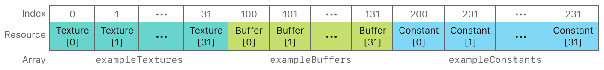

Metal框架详细解析（二十七）书签
* https://www.jianshu.com/p/ad2ceae81a2b  刀客传奇

* https://www.jianshu.com/p/dd63527a7a10 [张芳涛](https://www.jianshu.com/u/2d441a5445ed)
* https://www.jianshu.com/nb/26273087  [落影loyinglin](https://www.jianshu.com/u/815d10a4bdce)
* 设备GPU MTLDevice   GPU 设备

```swift
let devceGPU = MTLCreateSystemDefaultDevice()
```


*  MTLCommandQueue  命令队列

```swift
let commandQueue = [_device newCommandQueue];
```


* MTLCommandBuffer 命令缓冲区   

```swift
/// MTLCommandBuffer对象将这些命令合并为单个提交，
/// 但必须首先使用MTLCommandEncoder对象以与设备无关的方式对它们进行编码。
let commandBuffer = [_commandQueue commandBuffer];
```


* MTLCommandEncoder  命令编码器    

```swift
/// MTLCommandBuffer对象使用这些属性来创建新的MTLRenderCommandEncoder对象 
/// 之后，不再需要MTLRenderPassDescriptor对象
```

| 子类                                                         | 任务                       |
| ------------------------------------------------------------ | -------------------------- |
| [`MTLRenderCommandEncoder`](https://developer.apple.com/documentation/metal/mtlrendercommandencoder) | 图形渲染                   |
| [`MTLComputeCommandEncoder`](https://developer.apple.com/documentation/metal/mtlcomputecommandencoder) | 计算                       |
| [`MTLBlitCommandEncoder`](https://developer.apple.com/documentation/metal/mtlblitcommandencoder) | 内存管理                   |
| [`MTLParallelRenderCommandEncoder`](https://developer.apple.com/documentation/metal/mtlparallelrendercommandencoder) | 多个图形渲染任务并行编码。 |


*  MTLRenderPassDescriptor   命令编码器  描述符

```swift
/// MTLenderPassDescriptor是一个轻量级临时对象，具有许多可配置属性，
/// 现有MTLCommandBuffer对象使用这些属性来创建新的MTLRenderCommandEncoder对象。
/// 之后，不再需要MTLRenderPassDescriptor对象。

///  open var vertexFunction: MTLFunction? 顶点函数
///  open var fragmentFunction: MTLFunction? 片段函数
```

```swift
open class MTLRenderPipelineDescriptor : NSObject, NSCopying {
    open var label: String?
    open var vertexFunction: MTLFunction?
    open var fragmentFunction: MTLFunction?
    @NSCopying open var vertexDescriptor: MTLVertexDescriptor?
    
    /* Rasterization and visibility state */
    open var sampleCount: Int //DEPRECATED - aliases rasterSampleCount property
    open var rasterSampleCount: Int
    open var isAlphaToCoverageEnabled: Bool
    open var isAlphaToOneEnabled: Bool
    open var isRasterizationEnabled: Bool
    open var colorAttachments: MTLRenderPipelineColorAttachmentDescriptorArray { get }
    open var depthAttachmentPixelFormat: MTLPixelFormat
    open var stencilAttachmentPixelFormat: MTLPixelFormat
    @available(iOS 12.0, *)
    open var inputPrimitiveTopology: MTLPrimitiveTopologyClass
    @available(iOS 10.0, *)
    open var tessellationPartitionMode: MTLTessellationPartitionMode
    @available(iOS 10.0, *)
    open var maxTessellationFactor: Int
    @available(iOS 10.0, *)
    open var isTessellationFactorScaleEnabled: Bool
    @available(iOS 10.0, *)
    open var tessellationFactorFormat: MTLTessellationFactorFormat
    @available(iOS 10.0, *)
    open var tessellationControlPointIndexType: MTLTessellationControlPointIndexType
    @available(iOS 10.0, *)
    open var tessellationFactorStepFunction: MTLTessellationFactorStepFunction
    @available(iOS 10.0, *)
    open var tessellationOutputWindingOrder: MTLWinding
    @available(iOS 11.0, *)
    open var vertexBuffers: MTLPipelineBufferDescriptorArray { get }
    @available(iOS 11.0, *)
    open var fragmentBuffers: MTLPipelineBufferDescriptorArray { get }
    @available(iOS 12.0, *)
    open var supportIndirectCommandBuffers: Bool
    open func reset()
}
```


# ?  管线 和  命令编码器  的异同

MTLRenderPipelineDescriptor  和  MTLRenderPassDescriptor

```swift
let renderPipelineDescriptor = MTLRenderPipelineDescriptor.init()
let pipelineState = deviceGPU.makeRenderPipelineState(descriptor: renderPipelineDescriptor)
```

MTLRenderPipelineState  和 MTLRenderCommandEncoder

```swift
let renderPassDescriptor = MTLRenderPassDescriptor.init()
let renderCommandEncoder = commandbuffer?.makeRenderCommandEncoder(descriptor: renderPassDescriptor)
renderCommandEncoder?.setRenderPipelineState(pipelineState)
endEncoding
```

```swift
/// 计算管道只有一个步骤，就是kernel function（内核函数），内核函数直接读取并写入资源，不像渲染管道需要经过多个步骤； MTLComputePipelineState 代表一个计算处理管道，只需要一个内核函数就可以创建，相比之下，渲染管道需要顶点和片元两个处理函数

/*
临时对象（创建和销毁是廉价的，它们的创建方法都返回 autoreleased对象）
1.Command Buffers 
2.Command Encoders
代码中不需要持有
*/

/*
 高消耗对象（在性能相关的代码里应该尽量重用它,避免反复创建）
 1.Command Queues 
 2.Buffers
 3.Textures 
 5.Compute States 
 6.Render Pipeline States 
  代码中需长期持有。
*/
```


* 管线的作用和内容  命令编辑器的作用和 内容

```swift
 /// 操作队列
let commandQueue = deviceGPU.makeCommandQueue()

/// 命令缓存
let commandbuffer = commandQueue?.makeCommandBuffer()

/// metal Library
let library = deviceGPU.makeDefaultLibrary()

/// vertex & fragment  shader
let vertexFunction  = library?.makeFunction(name: "vertexFunction")
let fragmentFunction  = library?.makeFunction(name: "fragmentFunction")

/// 管线描述 设置
let renderPipelineDescriptor = MTLRenderPipelineDescriptor.init()
renderPipelineDescriptor.label = "Simple Pipeline";
renderPipelineDescriptor.vertexFunction  = vertexFunction
renderPipelineDescriptor.fragmentFunction = fragmentFunction;
renderPipelineDescriptor.colorAttachments[0].pixelFormat = mtkView.colorPixelFormat;


/// 生成管线
let pipelineState = deviceGPU.makeRenderPipelineState(descriptor: renderPipelineDescriptor)

/// 命令编码器创建
let renderPassDescriptor = MTLRenderPassDescriptor.init()
let renderCommandEncoder = commandbuffer?.makeRenderCommandEncoder(descriptor: renderPassDescriptor)

/// 创建管道后，可以将其分配给渲染命令编码器。 此操作将由该特定管道处理所有后续渲染命令
renderCommandEncoder?.setRenderPipelineState(pipelineState)


/*
使用setVertexBytes：length：atIndex：方法将顶点数据发送到顶点函数。如前所述，示例的vertexShader函数的签名有两个参数，vertices和viewportSizePointer，它们使用[[buffer（index）]]属性限定符。 setVertexBytes：length：atIndex：方法中index参数的值映射到[[buffer（index）]]属性限定符中具有相同index值的参数。因此，调用setVertexBytes：length：atIndex：方法为特定的顶点函数参数设置特定的顶点数据

[renderEncoder setVertexBytes:triangleVertices
                       length:sizeof(triangleVertices)
                      atIndex:AAPLVertexInputIndexVertices];

[renderEncoder setVertexBytes:&_viewportSize
                       length:sizeof(_viewportSize)
                      atIndex:AAPLVertexInputIndexViewportSize];

[renderEncoder drawPrimitives:MTLPrimitiveTypeTriangle
                  vertexStart:0
                  vertexCount:3];
*/
```


* 简单的流程为 

```swift
/*
1. 命令缓冲区（Command buffers）是从命令队列（command queue）创建的

2. 命令编码器（Command encoders）将命令编码到命令缓冲区中

3. 然后提交命令缓冲区并将其发送到GPU

4. GPU执行命令并将结果呈现为可绘制的

*/
```


# 分割线  ——— 内核计算管线


*  Create a Compute Processing Pipeline  创建计算处理管道 

```swift
/// 计算处理流水线仅由一个阶段组成，即可编程内核函数，它执行计算传递。 内核函数直接读取和写入资源，而不通过各种管道阶段传递资源数据

/// MTLComputePipelineState对象表示计算处理管道。 与图形渲染管道不同，您可以使用单个内核函数创建MTLComputePipelineState对象，而无需使用管道描述符
```


*  Write a Kernel Function - 编写内核函数

```swift
/// 内核函数每个线程执行一次，这类似于顶点函数每个顶点执行一次的方式。线程被组织成3D网格；编码计算传递通过声明网格的大小来指定要处理的线程数。因为此示例处理2D纹理，所以线程排列在2D网格中，

/// 其中每个线程对应于唯一的纹理元素

/// 内核函数的gid参数使用[[thread_position_in_grid]]属性限定符，该限定符定位计算网格中的线程。内核函数的每次执行都有一个唯一的gid值，使每个线程能够清晰地工作。
```


```metal
 kernel void
 grayscaleKernel(texture2d<half, access::read>  inTexture  [[texture(AAPLTextureIndexInput)]],
        texture2d<half, access::write> outTexture [[texture(AAPLTextureIndexOutput)]],
        uint2                          gid        [[thread_position_in_grid]]){
        half4 inColor  = inTexture.read(gid);
        half  gray     = dot(inColor.rgb, kRec709Luma);
        outTexture.write(half4(gray, gray, gray, 1.0), gid);
    }
```


* MTLComputeCommandEncoder -- Execute a Compute Pass - 执行计算传递

```objective-c
///  命令编码器创建  可以在不使用传递描述符的情况下创建MTLComputeCommandEncoder
id<MTLComputeCommandEncoder> computeEncoder = [commandBuffer computeCommandEncoder];

[computeEncoder setComputePipelineState:_computePipelineState];

[computeEncoder setTexture:_inputTexture
                   atIndex:AAPLTextureIndexInput];

[computeEncoder setTexture:_outputTexture
                   atIndex:AAPLTextureIndexOutput];

 [computeEncoder dispatchThreadgroups:_threadgroupCount
                   threadsPerThreadgroup:_threadgroupSize];
```


* 使用与线程组边界对齐的网格对计算命令进行编码。

  threadsPerThreadgroup &  threadgroupsPerGrid 

  ```swift
  /// 每个维度中网格中的线程组数。
  threadgroupsPerGrid
  /// 每个维度中一个线程组中的线程数
  threadsPerThreadgroup
  
  /*
  Metal通过将threadgroup（）的大小乘以线程组数（）来计算网格中的线程数。threadsPerThreadgroupthreadgroupsPerGrid
  
  如果数据大小与网格大小不匹配，则可能必须在计算功能中执行边界检查。有关示例，请参阅计算线程组和网格大小。
  
  当编码计算命令时，对先前在编码器上设置的参数或资源的任何必要引用都被记录为命令的一部分。对命令进行编码后，您可以安全地更改编码状态以设置编码其他命令所需的参数。
  */
  ```


* [[ threadgroup_position_in_grid ]]       	///网格中的线程组位置

  [[ threads_per_threadgroup ]]                   ///每个线程组的线程数

  [[ thread_position_in_threadgroup ]]       ///程组中的线程位置


```swift
  /// 使用以下代码，您还可以根据线程在线程组中的位置以及线程组在网格中的大小和位置来计算线程在网格中的位置
  kernel void 
  myKernel(uint2 threadgroup_position_in_grid   [[ threadgroup_position_in_grid ]],
           uint2 thread_position_in_threadgroup [[ thread_position_in_threadgroup ]],
           uint2 threads_per_threadgroup        [[ threads_per_threadgroup ]]) 
  {
      
      uint2 thread_position_in_grid = 
          (threadgroup_position_in_grid * threads_per_threadgroup) + 
          thread_position_in_threadgroup;
  }
```


* 实例代码

```swift
 /// 内核计算 函数
let computeFunction = library?.makeFunction(name:"grayscaleKernel")!

/// 计算管道
let computePipelineState =  try! deviceGPU.makeComputePipelineState(function: computeFunction!)

/// 命令编码器
let computerenderCommandEncoder = commandbuffer?.makeComputeCommandEncoder()
computerenderCommandEncoder?.setComputePipelineState(computePipelineState)

/// 计算线程组和网格大小

/// 线程执行最大宽度
let threadExecutionWidth = computePipelineState.threadExecutionWidth

/// 最大线程组
let maxTotalThreadsPerThreadgroup = computePipelineState.maxTotalThreadsPerThreadgroup
let height = maxTotalThreadsPerThreadgroup/threadExecutionWidth


/// 多少个线程组
let threadsPerThreadgroup = MTLSize(width:  threadExecutionWidth,
                                    height: height,
                                    depth: 1)

/// 多少个线程
let threadsPerGrid = MTLSizeMake(texture.width, texture.height, 1);


/// 总共多多个线程
/// 每个线程组的大小
computerenderCommandEncoder?.dispatchThreads(threadsPerGrid,
                                             threadsPerThreadgroup: threadsPerThreadgroup)

```


*  如果需要对线程组的大小和数量进行精细控制，则可以手动计算网格的划分方式。 在您的代码中，确保有足够的线程组来覆盖整个图像。 这是一个例子：

```swift
MTLSize threadgroupsPerGrid = MTLSizeMake((texture.width + w - 1) / w,
                                          (texture.height + h - 1) / h,
                                          1);

/// 注意 两个函数不一样哦
[computeCommandEncoder dispatchThreadgroups: threadgroupsPerGrid
                       threadsPerThreadgroup: threadsPerThreadgroup];
```


需要加越界判断

```swift
kernel void
simpleKernelFunction(texture2d<float, access::write> outputTexture [[texture(0)]],
                     uint2 position [[thread_position_in_grid]]) {
    
    if (position.x >= outputTexture.get_width() || position.y >= outputTexture.get_height()) {
        return;
    }
    
    outputTexture.write(float4(1.0), position);
}
```


*  调试 自定义 捕获 


```swift
let sharedCaptureManager = MTLCaptureManager.shared()
let myCaptureScope = sharedCaptureManager.makeCaptureScope(device: device)
myCaptureScope.label = "My Capture Scope"

myCaptureScope?.begin()
let commandBuffer = commandQueue.makeCommandBuffer()!
// Do Metal work
commandBuffer.commit()
myCaptureScope?.end()
```


*   构建`Metal 库 和 使用`

```swift
NSError *libraryError = NULL;
NSString *libraryFile = [[NSBundle mainBundle] pathForResource:@"MyLibrary" ofType:@"metallib"];
id <MTLLibrary> myLibrary = [_device newLibraryWithFile:libraryFile error:&libraryError];
if (!myLibrary) {
    NSLog(@"Library error: %@", libraryError.localizedDescription);
}
```


# Basic Buffers - 基本缓冲区


* 管理大量的顶点数据

  ```swift
  /// 事实上，对于超过4千字节（4,096字节）的顶点数据，Metal不允许使用setVertexBytes：length：atIndex：方法。更重要的是，不应在每个帧中重新分配和复制顶点数据
  
  /// Matal应用程序或游戏会绘制具有数千个顶点的模型，每个顶点都有多个顶点属性，这些顶点属性消耗几兆字节的内存。为了使这些应用程序或游戏能够很好地扩展并进行有效管理，Metal提供了由MTLBuffer对象表示的专用数据容器
  
  NSData *vertexData = [AAPLRenderer generateVertexData];
  // Create a vertex buffer by allocating storage that can be read by the GPU
  _vertexBuffer = [_device newBufferWithLength:vertexData.length
                                       options:MTLResourceStorageModeShared];
  
  // Copy the vertex data into the vertex buffer by accessing a pointer via
  // the buffer's `contents` property
  memcpy(_vertexBuffer.contents, vertexData.bytes, vertexData.length);
  ```

  ```swift
   [renderEncoder setVertexBuffer:_vertexBuffer
                            offset:0
                           atIndex:AAPLVertexInputIndexVertices];
    
    [renderEncoder setVertexBytes:&_viewportSize
                           length:sizeof(_viewportSize)
                          atIndex:AAPLVertexInputIndexViewportSize];
    
    // Draw the vertices of the quads
    [renderEncoder drawPrimitives:MTLPrimitiveTypeTriangle
                      vertexStart:0
                      vertexCount:_numVertices];
  ```


* Basic Texturing - 基本纹理

  ```swift
   /// Create a Texture - 创建纹理
    MTLTextureDescriptor *textureDescriptor = [[MTLTextureDescriptor alloc] init]
    textureDescriptor.pixelFormat = MTLPixelFormatBGRA8Unorm;
    textureDescriptor.width = image.width;
    textureDescriptor.height = image.height;
    _texture = [_device newTextureWithDescriptor:textureDescriptor];
    
    
    /// 我感觉这个有点OpenGL的做法了 
    NSUInteger bytesPerRow = 4 * image.width;
    MTLRegion region = {
        { 0, 0, 0 },                   // MTLOrigin
        {image.width, image.height, 1} // MTLSize
    };
    [_texture replaceRegion:region
                mipmapLevel:0
                  withBytes:image.data.bytes
                bytesPerRow:bytesPerRow];
  ```


* 采样Sample Texels

  ```swift
  /// amplingShader片段函数的签名包括colorTexture参数，该参数具有texture2d类型并使用[[texture（index）]]属性限定符。 此参数是对MTLTexture对象的引用，用于读取其纹素。
  
  /// 读取纹素也称为采样。 片段函数使用内置纹理sample（）函数来对texel数据进行采样。 sample（）函数有两个参数：一个采样器（textureSampler）和一个纹理坐标（in.textureCoordinate）。 采样器用于计算纹理元素的颜色，纹理坐标用于定位特定纹理元素。
  
  /// 当渲染的区域与纹理的大小不同时，采样器可以使用不同的算法来精确计算sample（）函数应返回的texel颜色。 mag_filter模式指定当区域大于纹理大小时，采样器应如何计算返回的颜色；min_filter模式指定当区域小于纹理大小时，采样器应如何计算返回的颜色。 为两个滤镜设置线性linear模式可使采样器平均给定纹理坐标周围的纹素颜色，从而使输出图像更平滑
  
  
  constexpr sampler textureSampler (mag_filter::linear,
                                    min_filter::linear);
  const half4 colorSample = colorTexture.sample(textureSampler, in.textureCoordinate);
  [renderEncoder setFragmentTexture:_texture
                            atIndex:AAPLTextureIndexBaseColor];
  ```


* 多重缓存 cpu  和 GPU 不需要相互等待

  ```swift
  for(NSUInteger bufferIndex = 0; bufferIndex < MaxBuffersInFlight; bufferIndex++)
  {
      _vertexBuffers[bufferIndex] = [_device newBufferWithLength:spriteVertexBufferSize
                                                         options:MTLResourceStorageModeShared];
  }
  
  _inFlightSemaphore = dispatch_semaphore_create(MaxBuffersInFlight);
  dispatch_semaphore_wait(_inFlightSemaphore, DISPATCH_TIME_FOREVER);
  [commandBuffer addCompletedHandler:^(id<MTLCommandBuffer> buffer)
  {
      dispatch_semaphore_signal(block_sema);
  }];
  ```


* 纹理的创建

  ```swift
  
  MTKTextureLoader *textureLoader = [[MTKTextureLoader alloc] initWithDevice:_device];
  
  _texture = [textureLoader newTextureWithName:@"Text"
                                   scaleFactor:1.0
                                        bundle:nil
                                       options:nil
                                         error:&error];
  ```


* 采样器

  ```swift
  MTLSamplerDescriptor *samplerDesc = [MTLSamplerDescriptor new];
              samplerDesc.minFilter = MTLSamplerMinMagFilterLinear;
              samplerDesc.magFilter = MTLSamplerMinMagFilterLinear;
              samplerDesc.mipFilter = MTLSamplerMipFilterNotMipmapped;
              samplerDesc.normalizedCoordinates = YES;
              samplerDesc.supportArgumentBuffers = YES;
  
  _sampler = [_device newSamplerStateWithDescriptor:samplerDesc]
  ```


*   MTLArgumentEncoder 用于将数据编码到参数缓冲区中的对象

  ```swift
  id <MTLArgumentEncoder> argumentEncoder =
  [fragmentFunction newArgumentEncoderWithBufferIndex:AAPLFragmentBufferIndexArguments];
  
  NSUInteger argumentBufferLength = argumentEncoder.encodedLength;
  
  _fragmentShaderArgumentBuffer = [_device newBufferWithLength:argumentBufferLength options:0];
  
  _fragmentShaderArgumentBuffer.label = @"Argument Buffer Fragment Shader";
  
  [argumentEncoder setArgumentBuffer:_fragmentShaderArgumentBuffer offset:0];
  ```

  ```swift
  for(uint32_t i = 0; i < AAPLNumTextureArguments; i++)
  {
  [argumentEncoder setTexture:_texture[i]
  atIndex:AAPLArgumentBufferIDExampleTextures+i];
  }
  
  for(uint32_t i = 0; i < AAPLNumBufferArguments; i++)
  {
  [argumentEncoder setBuffer:_dataBuffer[i]
  offset:0
  atIndex:AAPLArgumentBufferIDExampleBuffers+i];
  
  uint32_t *elementCountAddress =
  [argumentEncoder constantDataAtIndex:AAPLArgumentBufferIDExampleConstants+i];
  
  *elementCountAddress = (uint32_t)_dataBuffer[i].length / 4;
  }
  ```


  Metal shader 

  ```swift
  typedef struct FragmentShaderArguments {
      array<texture2d<float>, AAPLNumTextureArguments> exampleTextures  [[ id(AAPLArgumentBufferIDExampleTextures)  ]];
      array<device float *,  AAPLNumBufferArguments>   exampleBuffers   [[ id(AAPLArgumentBufferIDExampleBuffers)   ]];
      array<uint32_t, AAPLNumBufferArguments>          exampleConstants [[ id(AAPLArgumentBufferIDExampleConstants) ]];
  } FragmentShaderArguments;
  
  
  fragment float4
  fragmentShader(       RasterizerData            in                 [[ stage_in ]],
  device FragmentShaderArguments & fragmentShaderArgs [[ buffer(AAPLFragmentBufferIndexArguments) ]])
  ```


* 参数的传递

  ```swift
  /// 您不要调用MTLRenderCommandEncoder对象的setFragmentTexture：atIndex：方法来设置数组中的纹理。 相反，您调用MTLArgumentEncoder对象的setTexture：atIndex：方法，将数组中的纹理编码到参数缓冲区中，其中index对应于基本索引值n，加上数组中纹理的索引
  
  
  typedef struct FragmentShaderArguments {
      array<texture2d<float>, AAPLNumTextureArguments> exampleTextures  [[ id(AAPLArgumentBufferIDExampleTextures)  ]];
      array<device float *,  AAPLNumBufferArguments>   exampleBuffers   [[ id(AAPLArgumentBufferIDExampleBuffers)   ]];
      array<uint32_t, AAPLNumBufferArguments>          exampleConstants [[ id(AAPLArgumentBufferIDExampleConstants) ]];
  } FragmentShaderArguments;
  
  
  ///  此示例中的参数缓冲区被声明为FragmentShaderArguments结构，这是它的定义：
  
  typedef struct FragmentShaderArguments {
      array<texture2d<float>, AAPLNumTextureArguments> exampleTextures  [[ 			      id(AAPLArgumentBufferIDExampleTextures)  ]];
      
      array<device float *,  AAPLNumBufferArguments>   exampleBuffers   [[ id(AAPLArgumentBufferIDExampleBuffers)   ]];
      
      array<uint32_t, AAPLNumBufferArguments>          exampleConstants [[ id(AAPLArgumentBufferIDExampleConstants) ]];
      
  } FragmentShaderArguments;
  
  
  /// 此结构的每个元素都使用array<T, N>模板，该模板将元素定义为特定类型的数组，T和元素数量N。此参数缓冲区包含以下资源：
  
  exampleTextures，一个包含32个2D纹理的数组，其基本索引值为0。
  exampleBuffers，一个由32个浮点缓冲区组成的数组，其基本索引值为100。
  exampleConstants，一个由32个uint32_t常量组成的数组，其基本索引值为200。
  ```

  


